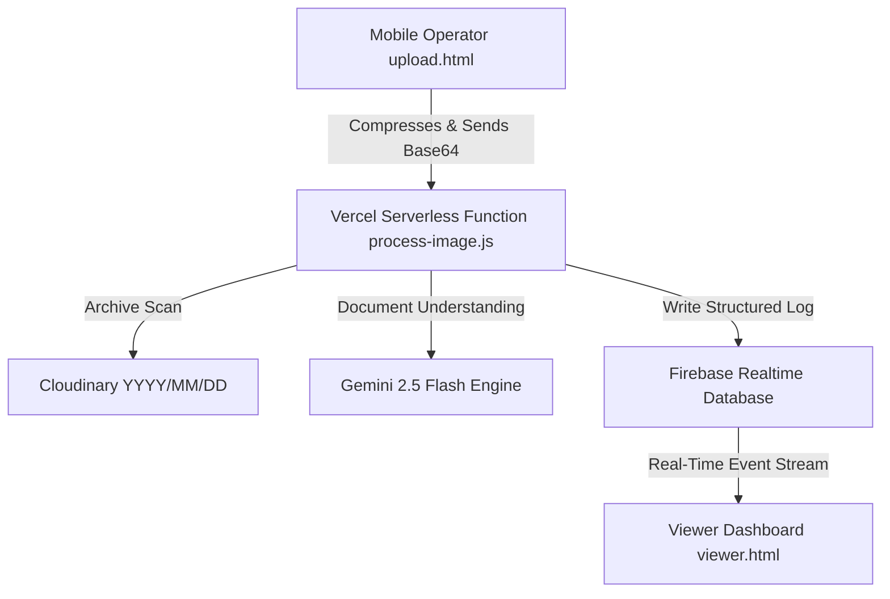

# LogDesk — Real-Time Logbook Digitization Platform

LogDesk is a production-ready, enterprise-grade system that converts physical logbook pages (printed or handwritten) into structured, live-synchronized digital spreadsheets in real time. 

Built with standard vanilla HTML/CSS/JavaScript and Node.js serverless functions, it archives scans permanently to Cloudinary, extracts document layouts using a backend document-processing engine, and updates live dashboards instantly via Firebase Realtime Database.

---

## Technical Architecture



---

## 1. Project Prerequisites & Setup

Ensure you have [Node.js](https://nodejs.org/) installed (v18+ recommended).

1. Clone or download the repository into your local environment.
2. In the root directory, install all required dependencies:
   ```bash
   npm install
   ```

---

## 2. Environment Variables Configuration

Create a `.env` file in the root directory (based on `.env.example`) and fill in the following keys:

```env
UPLOAD_PIN=1234
VIEWER_PIN=5678
SESSION_SECRET=your_jwt_session_secret_key_here
GEMINI_API_KEY=your_gemini_api_key_here
FIREBASE_DB_URL=https://your-firebase-project.firebaseio.com
FIREBASE_SECRET=your_firebase_database_secret_here
CLOUDINARY_CLOUD_NAME=your_cloudinary_cloud_name
CLOUDINARY_API_KEY=your_cloudinary_api_key
CLOUDINARY_API_SECRET=your_cloudinary_api_secret
```

- **UPLOAD_PIN**: The 4-digit code the mobile operator enters to unlock the camera console.
- **VIEWER_PIN**: The 4-digit code shared with the audience to unlock the live dashboard.
- **SESSION_SECRET**: A secure, random string used by the server to sign the 10-minute JWT session tokens.
- **GEMINI_API_KEY**: Your Google AI Studio API key.
- **FIREBASE_DB_URL**: The reference URL of your Firebase Realtime Database.
- **FIREBASE_SECRET**: Legacy Firebase Database secret key used to authorize serverless writes.
- **CLOUDINARY_CLOUD_NAME / API_KEY / API_SECRET**: Credentials gathered from your Cloudinary Management Console.

---

## 3. Database Configuration (Firebase)

1. Create a project in the [Firebase Console](https://console.firebase.google.com/).
2. Select **Realtime Database** and create a database instance. Choose your region and select **Start in locked mode**.
3. Go to the **Rules** tab of your Realtime Database and set the database security rules to allow read access publicly for the live dashboard stream, while restricting write access to authenticated server calls:
   ```json
   {
     "rules": {
       "logs": {
         ".read": true,
         ".write": false
       }
     }
   }
   ```
4. Go to **Project Settings** (gear icon) > **Service Accounts** > **Database Secrets** tab. Copy the secret key and paste it into `.env` as `FIREBASE_SECRET`. Copy the database URL from the database console and set it as `FIREBASE_DB_URL`.

---

## 4. Cloud Storage Configuration (Cloudinary)

1. Register or log in to [Cloudinary](https://cloudinary.com/).
2. Copy your **Cloud Name**, **API Key**, and **API Secret** from the main dashboard screen and write them to your `.env` variables.
3. Uploaded images will be organized automatically under date-structured folders (e.g. `logs/2026/06/22/image_xxxx.jpg`) with secure, permanent links.

---

## 5. Processing Engine Integration (Google Gemini)

1. Navigate to [Google AI Studio](https://aistudio.google.com/) and obtain a **Gemini API Key**.
2. Save this key in `.env` as `GEMINI_API_KEY`.
3. The serverless route `/api/process-image.js` internally calls the model `gemini-2.5-flash` with the image payload, enforcing a strict JSON response MIME type (`responseMimeType: "application/json"`) to automatically format dynamic tables.

---

## 6. Local Development Instructions

The easiest way to run the application locally is using the Vercel CLI, which emulates both the static files and serverless functions:

1. Install the Vercel CLI globally if you haven't already:
   ```bash
   npm install -g vercel
   ```
2. Start the local emulator:
   ```bash
   vercel dev
   ```
3. Open your browser and navigate to:
   - **Operator Upload Portal**: [http://localhost:3000/upload](http://localhost:3000/upload)
   - **Live Records Viewer**: [http://localhost:3000/viewer](http://localhost:3000/viewer)

---

## 7. Production Deployment to Vercel

The application is fully pre-configured to be deployed directly to Vercel.

### Option A: Deployment via Vercel CLI (Recommended)

1. Log in to your Vercel account:
   ```bash
   vercel login
   ```
2. Link and deploy your project (run in root directory):
   ```bash
   vercel
   ```
3. Set your production environment variables in the Vercel Dashboard under **Project Settings** > **Environment Variables**.
4. Promote the build to production:
   ```bash
   vercel --prod
   ```

### Option B: Git Integration

1. Push this project to a GitHub repository (e.g. `https://github.com/elrazortheodore-hue/LogDesk`).
2. Go to the [Vercel Dashboard](https://vercel.com/dashboard) and click **Add New** > **Project**.
3. Import your GitHub repository.
4. Expand **Environment Variables** and add all the keys listed in `.env.example`.
5. Click **Deploy**. Vercel will automatically configure rewrite rules from `vercel.json` and deploy both the serverless routes under `/api` and the static views under `/public`.
